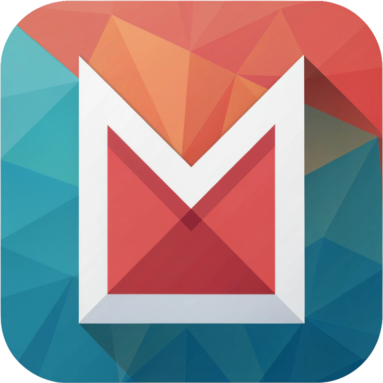

<p align="center">
  
</p>

# Manga Helper

[](https://github.com/FrostBy/manga-helper-standalone/releases/latest)

[🇷🇺 Русский](README.ru.md) | **English**

Cross-platform manga tracker browser extension. Track your reading progress across multiple manga sites and quickly find where more chapters are available.

## Features

- **Cross-platform tracking** — See chapter counts from other sites while browsing your favorite manga platform
- **Reading progress sync** — Shows your reading progress from each platform
- **Auto-search** — Automatically finds the same manga on other platforms by title matching
- **Manual linking** — Manually link manga across platforms when auto-search doesn't find a match
- **Mark as unavailable** — Explicitly mark a platform as unavailable (e.g. blocked by the copyright holder); it moves to the bottom of the list and is skipped by auto-refresh
- **Chapter comparison** — Highlights platforms that have more chapters available
- **Popup search** — Search manga across all platforms from the extension popup with cover thumbnails
- **Debug logging** — Configurable log level (DEBUG/INFO/WARN/ERROR/OFF) in popup settings
- **Caching** — Results are cached to minimize API requests

## Supported Platforms

| Platform | Domain | Status |
|----------|--------|--------|
| MangaLib | mangalib.me | ✅ Full support |
| Senkuro | senkuro.com | ✅ Full support |
| MangaBuff | mangabuff.ru | ✅ Full support |
| ReadManga | readmanga.io | ✅ Full support |
| Inkstory | inkstory.net | ✅ Full support |

## Installation

### From Source

1. Clone the repository:
   ```bash
   git clone https://github.com/FrostBy/manga-helper-standalone.git
   cd manga-helper-standalone
   ```

2. Install dependencies:
   ```bash
   pnpm install
   ```

3. Build the extension:
   ```bash
   pnpm build
   ```

4. Load in browser:
   - **Chrome**: Go to `chrome://extensions/`, enable Developer mode, click "Load unpacked", select `.output/chrome-mv3`
   - **Firefox**: Go to `about:debugging#/runtime/this-firefox`, click "Load Temporary Add-on", select any file in `.output/firefox-mv2`

### Development

```bash
# Start dev server with hot reload
pnpm dev

# Firefox
pnpm dev:firefox

# Type checking
pnpm typecheck
```

## Usage

1. Navigate to a manga page on any supported platform
2. Look for the "Other sites" button near the bookmark/favorite button
3. Click to see chapter counts from other platforms
4. Green highlight indicates more chapters are available on that platform
5. Click the edit icon to manually link a manga if auto-search didn't find it

## Tech Stack

- [WXT](https://wxt.dev/) — Next-gen web extension framework
- [Preact](https://preactjs.com/) — Fast 3kB React alternative
- [Zustand](https://zustand.docs.pmnd.rs/) — Lightweight state management
- [Tippy.js](https://atomiks.github.io/tippyjs/) — Tooltip/popover library
- TypeScript, Sass

