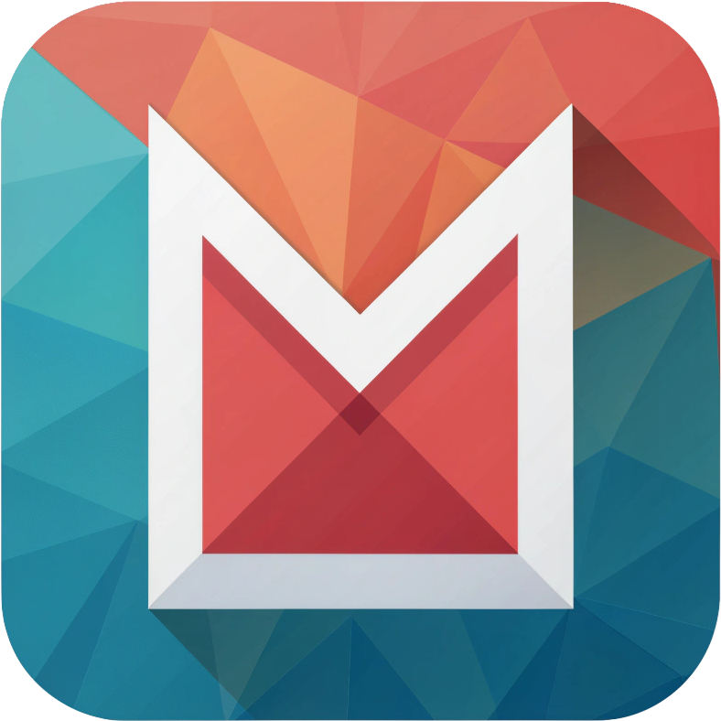

<p align="center">
  
</p>

# Manga Helper

[](https://github.com/FrostBy/manga-helper-standalone/releases/latest)

**Русский** | [🇬🇧 English](README.md)

Кросс-платформенный трекер манги. Отслеживайте прогресс чтения на разных сайтах и быстро находите, где доступно больше глав.

## Возможности

- **Кросс-платформенный трекинг** — Смотрите количество глав с других сайтов, находясь на любимой платформе
- **Синхронизация прогресса** — Показывает ваш прогресс чтения с каждой платформы
- **Автопоиск** — Автоматически находит ту же мангу на других платформах по названию
- **Ручная привязка** — Вручную связывайте мангу между платформами, если автопоиск не нашёл
- **Сравнение глав** — Подсвечивает платформы, где доступно больше глав
- **Поиск в popup** — Ищите мангу по всем платформам из popup расширения с обложками
- **Отладочные логи** — Настраиваемый уровень логов (DEBUG/INFO/WARN/ERROR/OFF) в настройках popup
- **Кэширование** — Результаты кэшируются для минимизации запросов к API

## Поддерживаемые платформы

| Платформа | Домен | Статус |
|-----------|-------|--------|
| MangaLib | mangalib.me | ✅ Полная поддержка |
| Senkuro | senkuro.com | ✅ Полная поддержка |
| MangaBuff | mangabuff.ru | ✅ Полная поддержка |
| ReadManga | readmanga.io | ✅ Полная поддержка |
| Inkstory | inkstory.net | ✅ Полная поддержка |

## Установка

### Из исходников

1. Клонируйте репозиторий:
   ```bash
   git clone https://github.com/FrostBy/manga-helper-standalone.git
   cd manga-helper-standalone
   ```

2. Установите зависимости:
   ```bash
   pnpm install
   ```

3. Соберите расширение:
   ```bash
   pnpm build
   ```

4. Загрузите в браузер:
   - **Chrome**: Перейдите в `chrome://extensions/`, включите режим разработчика, нажмите "Загрузить распакованное", выберите `.output/chrome-mv3`
   - **Firefox**: Перейдите в `about:debugging#/runtime/this-firefox`, нажмите "Загрузить временное дополнение", выберите любой файл в `.output/firefox-mv2`

### Разработка

```bash
# Запуск dev-сервера с hot reload
pnpm dev

# Firefox
pnpm dev:firefox

# Проверка типов
pnpm typecheck
```

## Использование

1. Перейдите на страницу манги на любой поддерживаемой платформе
2. Найдите кнопку "Другие сайты" рядом с кнопкой закладки
3. Нажмите, чтобы увидеть количество глав с других платформ
4. Зелёная подсветка означает, что на этой платформе доступно больше глав
5. Нажмите на иконку редактирования, чтобы вручную привязать мангу, если автопоиск не нашёл

## Технологии

- [WXT](https://wxt.dev/) — Фреймворк для браузерных расширений
- [Preact](https://preactjs.com/) — Быстрая 3kB альтернатива React
- [Zustand](https://zustand.docs.pmnd.rs/) — Легковесный state management
- [Tippy.js](https://atomiks.github.io/tippyjs/) — Библиотека тултипов/поповеров
- TypeScript, Sass

